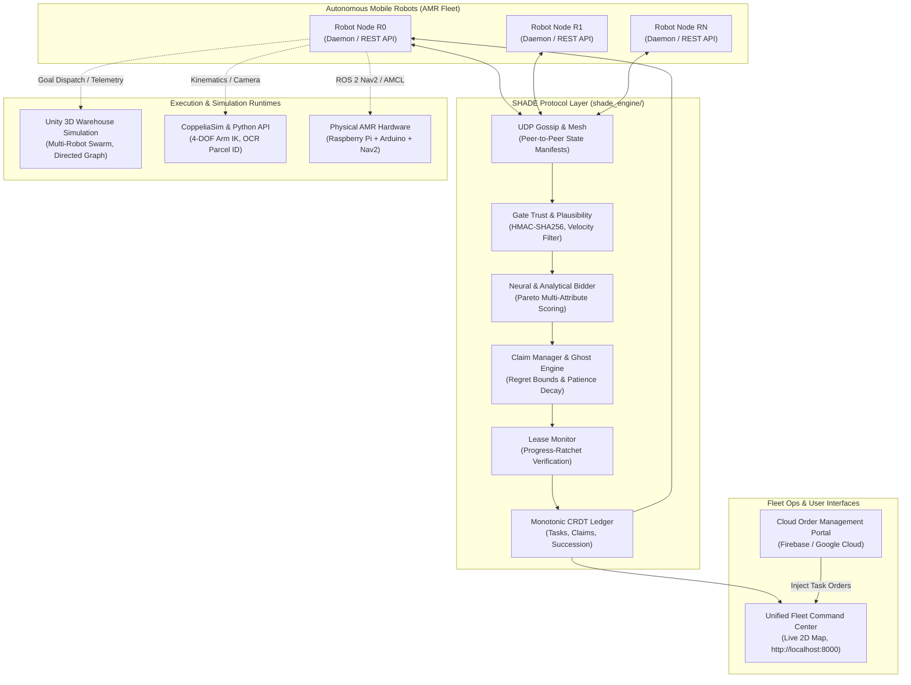
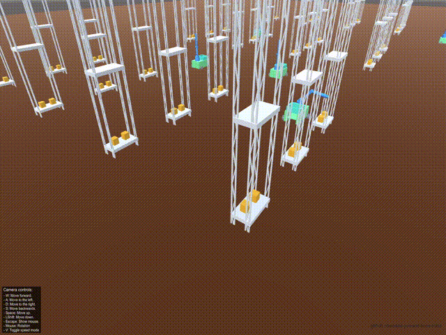
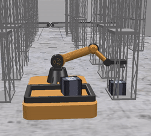
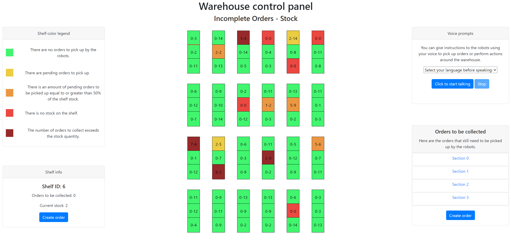
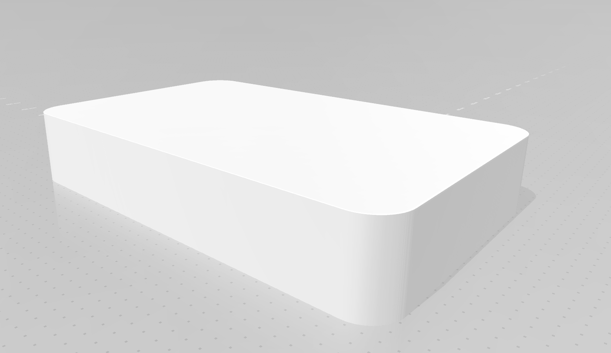
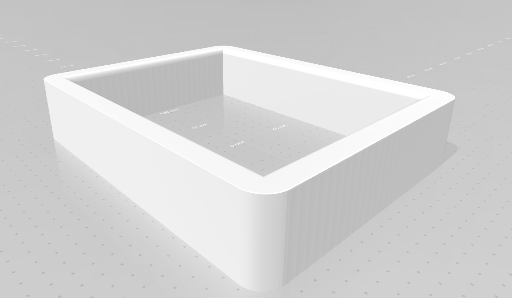
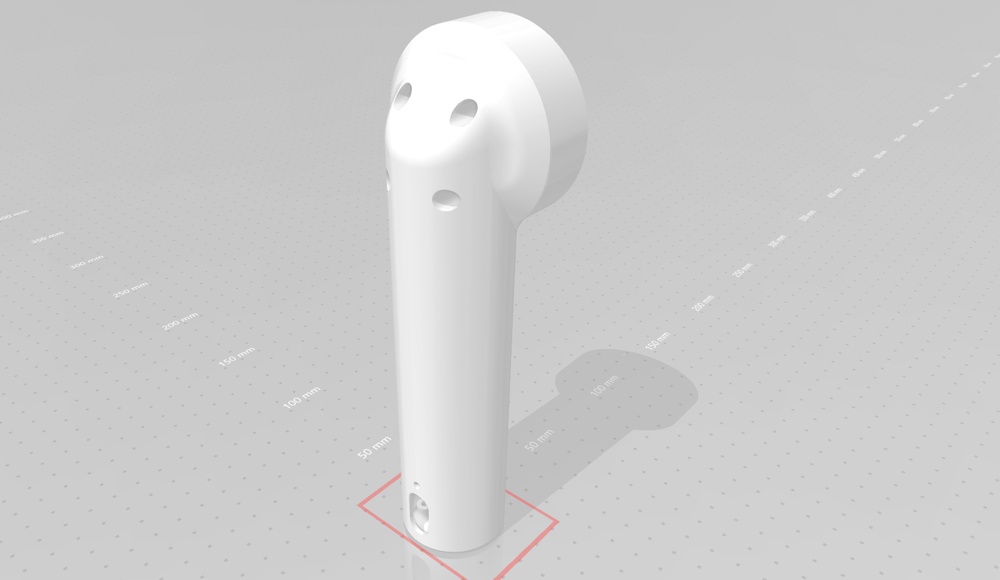
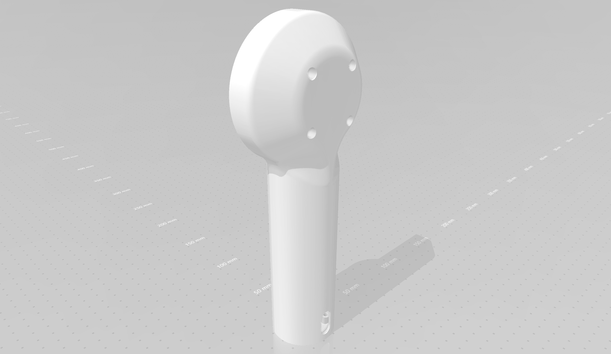

# Multi-Robot Task Auction (PNR2)
## SHADE: Shadow-Hedged Auction with Decaying Estimates
**A Ghost-Aware, Byzantine-Fault-Tolerant Decentralized Task Allocation Architecture for Autonomous Robot Fleets**

[](https://www.python.org/downloads/)
[-success.svg)](#quick-start-standalone-python)
[](#-docker--containerized-deployment)
[](#-kubernetes-cloud--edge-cluster)
[](#-unity-simulation)
[](#-coppeliasim-simulation)
[](LICENSE)

---

## 📑 Table of Contents

- [Overview & Problem Statement (PNR2)](#-overview--problem-statement-pnr2)
- [The Hidden Trilemma of Fleet Auctions](#-the-hidden-trilemma-of-fleet-auctions)
- [The SHADE Protocol: Key Innovations](#-the-shade-protocol-key-innovations)
  - [1. Implicit Bidding ($O(N)$ Communication)](#1-implicit-bidding-on-communication)
  - [2. Ghost Bids & Regret-Bounded Claiming](#2-ghost-bids--regret-bounded-claiming)
  - [3. Progress-Ratchet Leases](#3-progress-ratchet-leases)
  - [4. Succession Ranks & Staggered Takeover](#4-succession-ranks--staggered-takeover)
  - [5. Finish-Line Yield Rule](#5-finish-line-yield-rule)
  - [6. Decision-Focused Neural Bidder](#6-decision-focused-neural-bidder)
  - [7. Gate Trust, Kinematic Plausibility & Quarantine](#7-gate-trust-kinematic-plausibility--quarantine)
- [System Architecture](#-system-architecture)
- [Interactive Fleet Command & Live Dashboards](#-interactive-fleet-command--live-dashboards)
- [Quick Start Guide](#-quick-start-guide)
  - [1. Run Unit & Integration Tests](#1-run-unit--integration-tests)
  - [2. Interactive Terminal Fleet Simulation](#2-interactive-terminal-fleet-simulation)
  - [3. Full Fleet Command Server & Live Web UI](#3-full-fleet-command-server--live-web-ui)
  - [4. Individual Robot Microservice Node](#4-individual-robot-microservice-node)
- [Docker & Containerized Deployment](#-docker--containerized-deployment)
- [Kubernetes Cloud & Edge Cluster](#-kubernetes-cloud--edge-cluster)
- [REST API Reference](#-rest-api-reference)
- [Robotics Simulation Suites](#-robotics-simulation-suites)
  - [Unity Warehouse Swarm Simulation](#unity-warehouse-swarm-simulation)
  - [CoppeliaSim & Computer Vision Pipeline](#coppeliasim--computer-vision-pipeline)
- [Cloud Order Management Web Portal](#-cloud-order-management-web-portal)
- [Hardware Schemes & 3D Fabrication](#-hardware-schemes--3d-fabrication)
- [Mathematical Guarantees & Complexity](#-mathematical-guarantees--complexity)
- [Repository File Map](#-repository-file-map)
- [Documentation & References](#-documentation--references)
- [Authors & Acknowledgments](#-authors--acknowledgments)

---

## 📌 Overview & Problem Statement (PNR2)

In real-world logistics and hazardous robotics environments, **centralized task dispatchers** represent critical single points of failure. When wireless channels experience heavy attenuation, RF jamming, or physical partition barriers, central dispatchers lose contact with the fleet, leaving mobile robots idle and critical tasks starved.

**Statement ID**: `PNR2`  
**Theme**: Robotics, Drones, and Autonomous Systems  
**Core Objective**: Design and implement an autonomous, fully decentralized, auction-based task-allocation protocol for multi-robot fleets that:
1. Dynamically assigns tasks based on high-dimensional, real-time robot state (battery, kinematics, payloads, deadline slacks, uncertainty).
2. Remains completely operational during severe communication failures and network partitions without central coordinators or voting quorums.
3. Resolves conflicting bids and adversarial edge cases (Byzantine spoofing, stalled motors, packet drops) with mathematically bounded regret and zero task loss.

This repository provides the complete, production-grade implementation of **SHADE (Shadow-Hedged Auction with Decaying Estimates)** alongside integrated high-fidelity physics simulations in **Unity** and **CoppeliaSim**, an enterprise **Fleet Command Web Dashboard**, containerized orchestration (**Docker & Kubernetes**), and hardware manufacturing blueprints.

---

## ⚖️ The Hidden Trilemma of Fleet Auctions

Under severe network degradation, any task-allocation auction faces a fundamental trade-off:

```
                  Optimality
               (Best robot wins)
                     /\
                    /  \
                   /    \
                  / SHADE\
                 /________\
Latency / Starvation        Duplicate Work
(Tasks claimed fast)      (Partition healed yields)
```

1. **Eager Claiming**: Sacrifices optimality by aggressively awarding tasks to mediocre local robots while superior candidates are temporarily partitioned.
2. **Quorum / Consensus Bidding**: Sacrifices availability and starves the isolated partition half because a quorum can never be formed.
3. **Fixed Timeout Revocation**: Treats a superior but radio-silent robot as dead, causing bid churn and duplicated work.

**The SHADE Solution**: Replace static timeouts with **regret** ($\mathcal{R}$). Quantify the maximum possible bid difference between the best visible robot and any unreachable peer. Bound this regret mathematically with an age-decaying patience threshold $\mathcal{E}(\text{age})$.

---

## 🔬 The SHADE Protocol: Key Innovations

### 1. Implicit Bidding ($O(N)$ Communication)
Conventional distributed auctions broadcast bid messages for every single task ($O(N \times M)$ overhead). In SHADE:
- Each robot periodically signs and broadcasts its compact **State Manifest** containing pose $(x, y)$, battery %, velocity $v$, current payload, and sequence number.
- Task bidding functions are pure and deterministic. Any robot in the fleet computes the bid of **every other robot** for any task locally.
- Network bandwidth scales strictly with fleet size $N$, **independent of task volume $M$**.

### 2. Ghost Bids & Regret-Bounded Claiming
When robot $R$ stops hearing manifests from peer $P$, $P$ is not dropped. Instead, $P$ becomes a **Ghost**:
- The fleet calculates an **optimistic reachability upper bound** for $P$, projecting its maximum possible movement towards the task at top speed $v_{\max}$.
- A robot claims task $\tau$ only when its bid satisfies the Regret Bound:
  $$\text{Regret}(R, \tau) = \max_{P \in \text{Fleet}} \text{Bid}(P, \tau) - \text{Bid}(R, \tau) \le \mathcal{E}(\text{age}_\tau)$$
- The patience function $\mathcal{E}(\text{age})$ grows smoothly over task age, guaranteeing that tasks never starve even under total prolonged isolation.

### 3. Progress-Ratchet Leases
When a robot claims a task, it acquires a time-bounded lease. Unlike standard leases that require renewal heartbeat voting:
- Renewal requires **verifiable physical progress towards the goal**:
  $$\Delta d = d(x_{t_1}, x_{\tau}) - d(x_{t_2}, x_{\tau}) \ge \rho_{\min} \cdot (t_2 - t_1)$$
- If a robot suffers mechanical failure, wheel slippage, or motor stall, its lease expires automatically without requiring a consensus quorum.

### 4. Succession Ranks & Staggered Takeover
To avoid thundering-herd re-auctions upon lease expiry:
- Every node precomputes deterministic **Succession Ranks** (1st runner-up, 2nd runner-up) during the implicit bid phase.
- Successors observe lease timeouts and step in after a deterministic delay $\Delta t_{\text{delay}} = \text{Rank} \times \delta_{\text{guard}}$, enabling smooth, sub-second failovers.

### 5. Finish-Line Yield Rule
When a healed network partition reveals that two robots claimed the same task in isolation:
- The protocol evaluates relative proximity to task completion:
  $$\text{Winner} = \arg\min_{R \in \{A, B\}} d(x_R, x_{\tau})$$
- The loser yields unconditionally and logs the event to its CRDT ledger. It is mathematically proven that **two honest robots can never both abandon a contested task**.

### 6. Decision-Focused Neural Bidder
In addition to analytical scoring, the engine includes a lightweight, deterministic Multi-Layer Perceptron (`shade/neural_bidder.py`) trained to evaluate high-dimensional trade-offs in $O(1)$ inference:
- **Input Dimensions (6)**: Normalized Euclidean Distance, Battery SoC, Deadline Slack ($\text{ETA} / \Delta t_{\text{deadline}}$), Cargo Capacity Ratio, Task Priority, and Observation Uncertainty ($\sigma$).
- **Architecture**: Fully deterministic 6 $\to$ 12 $\to$ 6 $\to$ 1 forward pass with calibrated weights and zero external dependencies (pure Python).

### 7. Gate Trust, Kinematic Plausibility & Quarantine
Adversarial and faulty nodes are contained before influencing the ledger:
- **HMAC-SHA256 Manifest Signatures**: Prevent impersonation and man-in-the-middle tampering.
- **Physical Plausibility Checks**: Detect impossible teleportation or velocity violations ($v > v_{\max}$).
- **Quarantine Strikes**: Malicious or erratic nodes accumulate strikes and are quarantined from the auction without stalling honest peers.

---

## 🏗️ System Architecture



---

## 🖥️ Interactive Fleet Command & Live Dashboards

The repository includes a comprehensive, browser-based **Fleet Command Dashboard** (`fleet_server.py`) with zero frontend framework dependencies:

- **Live 2D Warehouse Map**: Real-time canvas rendering showing robot positions, orientations, battery rings, communication ranges, active target paths, and pending task zones.
- **Dynamic Task Injection**: Dispatch priority-weighted warehouse tasks directly into the decentralized mesh.
- **Interactive Fault Injection**:
  - **Simulate Network Partitions**: Sever robot communication links on the fly to observe ghost bidding and regret-bounded claiming.
  - **Simulate Motor Stalls**: Trigger mechanical freezes to observe autonomous progress-ratchet lease revocations and runner-up succession.
- **Node-Specific Microservice Portals**: Each robot exposes its own localized web dashboard (`http://localhost:8080` through `8084`) reflecting its private CRDT ledger state.

---

## ⚡ Quick Start Guide

### Prerequisites
- Python 3.9+ (Zero third-party pip dependencies required for core protocol engine)
- Optional: Docker & Docker Compose, Unity 2021+, CoppeliaSim 4.x

```bash
# Clone the repository
git clone git@github.com:sashankmudraboyina/multi-robot-task-auction.git
cd multi-robot-task-auction
```

### 1. Run Unit & Integration Tests
Execute the comprehensive test suite covering cryptographic signatures, kinematic plausibility, ghost bounds, regret patience, and lease progress ratchets:
```bash
PYTHONPATH=shade_engine python3 shade_engine/tests/test_shade_protocol.py
```
*Output: `Ran 7 tests in 0.004s — OK`*

### 2. Interactive Terminal Fleet Simulation
Simulate a 5-robot warehouse fleet with real-time network partition injection ($t=5\text{s}$) and automatic partition healing ($t=15\text{s}$):
```bash
PYTHONPATH=shade_engine python3 shade_engine/cli.py sim --robots 5 --duration 25
```

### 3. Full Fleet Command Server & Live Web UI
Launch the unified fleet daemon running 5 autonomous decentralized agents and the web control room:
```bash
python3 shade_engine/fleet_server.py
```
Open **`http://localhost:8000/`** in your browser to access the Unified Fleet Command Center.

### 4. Individual Robot Microservice Node
Deploy a single SHADE agent node as an autonomous background daemon:
```bash
PYTHONPATH=shade_engine python3 shade_engine/cli.py node --robot-id 0 --port 8080 --x 10 --y 15
```
Access the robot's local telemetry and status interface at **`http://localhost:8080/`**.

---

## 🐳 Docker & Containerized Deployment

Deploy a complete 5-robot containerized warehouse cluster running on a private bridge network (`shade-net`):

```bash
# 1. Build the lightweight, multi-stage Docker image
docker build -t shade-protocol:latest shade_engine/

# 2. Launch the 5-robot fleet cluster
docker compose -f shade_engine/docker-compose.yml up -d

# 3. Inspect active fleet containers
docker compose -f shade_engine/docker-compose.yml ps
```

### Fleet Cluster Port Allocation
| AMR Node | Container Name | HTTP Dashboard | UDP Gossip Port | Initial Coordinates |
| :--- | :--- | :--- | :--- | :--- |
| **Robot 0** | `shade-robot-0` | [http://localhost:8080](http://localhost:8080) | `9999/udp` | $(10, 15)$ |
| **Robot 1** | `shade-robot-1` | [http://localhost:8081](http://localhost:8081) | `9999/udp` | $(25, 15)$ |
| **Robot 2** | `shade-robot-2` | [http://localhost:8082](http://localhost:8082) | `9999/udp` | $(40, 15)$ |
| **Robot 3** | `shade-robot-3` | [http://localhost:8083](http://localhost:8083) | `9999/udp` | $(55, 15)$ |
| **Robot 4** | `shade-robot-4` | [http://localhost:8084](http://localhost:8084) | `9999/udp` | $(70, 15)$ |

---

## ☸️ Kubernetes Cloud & Edge Cluster

Deploy the protocol across Kubernetes, K3s, or MicroK8s edge clusters:

```bash
kubectl apply -f shade_engine/k8s/deployment.yaml
```

**Enterprise Features Included:**
- **Headless Service (`shade-headless`)**: Dynamic peer-to-peer mesh discovery via internal cluster DNS SRV records.
- **Dynamic ConfigMap (`shade-config`)**: Tune protocol parameters (`THETA`, `LEASE_DURATION`, `RHO_MIN`) without container rebuilds.
- **Liveness & Readiness Health Probes**: Continuous monitoring via `/health` on port 8080.

---

## 📡 REST API Reference

Each robot microservice exposes an HTTP API for seamless integration with ROS 2 Nav2, external dispatchers, or monitoring agents:

| Method | Endpoint | Description | Example Payload / Usage |
| :--- | :--- | :--- | :--- |
| `GET` | `/status` | Complete robot manifest, ledger state, and active claims | `curl http://localhost:8080/status` |
| `GET` | `/health` | Container liveness and readiness probe | `curl http://localhost:8080/health` |
| `POST` | `/tasks` | Inject a new warehouse order / task into the fleet | `curl -X POST http://localhost:8080/tasks -H "Content-Type: application/json" -d '{"x": 30.0, "y": 45.0, "priority": 1.5}'` |
| `POST` | `/faults/toggle_partition` | Toggles network partition state on this node | `curl -X POST http://localhost:8080/faults/toggle_partition` |
| `POST` | `/faults/toggle_stall` | Toggles motor stall state (triggers progress ratchet) | `curl -X POST http://localhost:8080/faults/toggle_stall` |

---

## 🤖 Robotics Simulation Suites

### Unity Warehouse Swarm Simulation
Located in [`Simulation/Unity/`](Simulation/Unity/), this simulation models high-level warehouse swarm logistics:
- **Directed Graph Routing**: The warehouse floor is modeled as a directed circulation graph preventing head-on collisions.
- **Autonomous Navigation & Collision Prevention**: Proximity raycasts and priority yield colliders prevent traffic gridlock.
- **Integrated Pick & Ramp Drop**: Robots navigate to pickup shelves, actuate pneumatic grippers, carry cargo in onboard baskets, and drop items down rotatable ramps onto conveyor belts.

**Run the Precompiled Linux Executable**:
```bash
./run_simulation.sh
```

<p align="center">
  
</p>

### CoppeliaSim & Computer Vision Pipeline
Located in [`Simulation/Coppelia/`](Simulation/Coppelia/), this subsystem demonstrates precise low-level robotic manipulation and edge perception:
- **4-DOF Robotic Arm Kinematics**: Geometric Inverse Kinematics based on the Denavit-Hartenberg (DH) analytical model:
  
  | Axis | $\theta$ | $d$ | $a$ | $\alpha$ |
  | :--- | :--- | :--- | :--- | :--- |
  | **1** | $\theta_1$ | $l_1$ | $0$ | $90^\circ$ |
  | **2** | $\theta_2$ | $0$ | $l_2$ | $0^\circ$ |
  | **3** | $\theta_3$ | $0$ | $l_3$ | $0^\circ$ |
  | **4** | $\theta_4$ | $0$ | $l_4$ | $0^\circ$ |

- **Optical Character Recognition (OCR)**: Vision pipeline using 8-connectivity region labeling, bounding-box segmentation, and a custom Multi-Layer Perceptron to scan parcel IDs directly from onboard camera streams.

<p align="center">
  
</p>

---

## 🌐 Cloud Order Management Web Portal

Located in [`website/`](website/), the warehouse management dashboard provides stock monitoring and real-time order generation:
- **Manual & Voice Ordering**: Human operators can dispatch tasks manually or dictate voice commands powered by Google Cloud Speech-to-Text.
- **Cloud Architecture**: Built on Firebase Hosting, Google Cloud Functions, and Vertex AI.

<p align="center">
  
</p>

---

## ⚙️ Hardware Schemes & 3D Fabrication

For physical robot builds, printable CAD models and electronic schematics are provided:
- **3D Parts** ([`3D Components/`](3D%20Components/)): Base, chassis, payload basket, 4-DOF manipulator joints (shoulder, elbow, forearm, wrist), and rotatable ramp.
- **Dual-Computer Electronics** ([`imgs/schemes/`](imgs/schemes/)):
  - **Arduino**: Low-level motor drivers, encoder feedback, and pneumatic solenoids.
  - **Raspberry Pi**: High-level SHADE daemon, mesh networking, computer vision, and ROS 2 navigation stack.

<p align="center">
  
  
  
  
</p>

---

## 📐 Mathematical Guarantees & Complexity

| Property | Theoretical Bound | Practical Guarantee |
| :--- | :--- | :--- |
| **Communication Complexity** | $O(N)$ per gossip round | Independent of task count $M$; immune to auction broadcast storms |
| **Starvation Bound** | $t_{\text{claim}} \le P + (n-1)\delta + \Gamma$ | Tunable patience window $P$ ensures tasks are never abandoned indefinitely |
| **Regret Bound Under Partition** | $\mathcal{R}(R, \tau) \le \mathcal{E}(\text{age}_\tau)$ | Regret is bounded by task age; closes to zero when network heals |
| **Task Retention** | Zero loss ($\ge 1$ owner preserved) | Finish-Line Yield rule guarantees that two honest robots can never both abandon a task |
| **Byzantine Damage Ceiling** | $\le 1$ lease duration per attack | Physical plausibility checks quarantine repeat offenders after 3 strikes |

---

## 📂 Repository File Map

```
multi-robot-task-auction/
├── PNR2.pdf                                    # Official Problem Statement (PNR2)
├── SHADE A Ghost-Aware Decentralized ...pdf    # 32-page mathematical protocol specification
├── PNR2_SHADE_Project_Presentation.pptx        # Project presentation slide deck
├── README.md                                   # Master project documentation
├── run_simulation.sh                           # One-click Linux launcher for Unity simulation
│
├── shade_engine/                               # Core SHADE Protocol Package (Python 3.9+)
│   ├── shade/
│   │   ├── models.py                           # Vector2D, RobotManifest, Task, Claim dataclasses
│   │   ├── crypto.py                           # HMAC-SHA256 signature generation & verification
│   │   ├── gate_trust.py                       # Kinematic plausibility checks & quarantine logic
│   │   ├── bid_evaluator.py                    # Multi-attribute scoring & ghost reachability bounds
│   │   ├── claim_manager.py                    # Regret bounds, decaying patience & succession ranks
│   │   ├── lease_monitor.py                    # Progress-ratchet lease validation & stall detection
│   │   ├── ledger.py                           # Monotonic G-Set CRDT ledger replica
│   │   ├── network.py                          # UDP broadcast/gossip mesh networking
│   │   ├── neural_bidder.py                    # Decision-Focused Neural Bidder (MLP)
│   │   ├── api.py                              # Microservice HTTP REST API & Node Web UI
│   │   └── agent.py                            # Autonomous 10 Hz agent control loop
│   ├── tests/
│   │   └── test_shade_protocol.py              # Protocol unit and integration test suite
│   ├── k8s/
│   │   └── deployment.yaml                     # Kubernetes Headless Service, ConfigMap & Deploy
│   ├── Dockerfile                              # Multi-stage lightweight container definition
│   ├── docker-compose.yml                      # 5-robot containerized cluster orchestration
│   ├── cli.py                                  # Unified CLI for single nodes or fleet simulations
│   ├── fleet_server.py                         # Unified Fleet Server & Live 2D Command Dashboard
│   ├── setup.py / pyproject.toml               # Pip package distribution configuration
│   └── README.md                               # Standalone engine documentation
│
├── Simulation/
│   ├── Unity/                                  # Unity 3D Warehouse Simulation
│   │   ├── Warehouse simulation/               # Unity project source assets, scripts & C# code
│   │   └── screenshots/                        # Architecture graphics & runtime GIFs
│   └── Coppelia/                               # CoppeliaSim Python simulation
│       ├── main.py                             # Robot control loop & inverse kinematics demo
│       ├── LabelingRegions.py                  # Connected-component OCR region labeling
│       ├── LettersNumbersClassification.py     # MLP neural classifier for parcel identification
│       └── simulation_scene.ttt                # CoppeliaSim 3D scene file
│
├── website/                                    # Warehouse stock management web portal
│   └── ...                                     # Web frontend and Firebase cloud services
│
├── 3D Components/                              # Mechanical 3D CAD files (.stl / .obj)
└── imgs/                                       # Diagrams, electronic schematics, and screenshots
```

---

## 📚 Documentation & References

1. **Protocol Paper**: See [`SHADE A Ghost-Aware Decentralized Auction Protocol (PNR2 Solution).pdf`](SHADE%20A%20Ghost-Aware%20Decentralized%20Auction%20Protocol%20(PNR2%20Solution).pdf) for full mathematical theorems, state machine specifications, and regret bounds.
2. **Project Slides**: See [`PNR2_SHADE_Project_Presentation.pptx`](PNR2_SHADE_Project_Presentation.pptx) for slide-by-slide architecture summaries.
3. **Problem Statement**: See [`PNR2.pdf`](PNR2.pdf) for the original evaluation criteria and prompt specification.

---

## 👥 Authors & Acknowledgments

- **Sashank Mudraboyina** ([@sashankmudraboyina](https://github.com/sashankmudraboyina))
- **Sai Charan** ([@charansai1003](https://github.com/charansai1003))
- **Harshith** ([@Harshith](https://github.com/Harshith))

*Base robotics simulation environment adapted from the Warehouse Worker project by Abel García, Javier de Dios, Arnau Mayoral, and Núria Martínez.*
